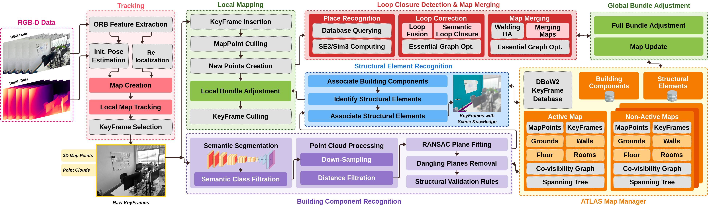

# Visual S-Graphs (vS-Graphs)


<!-- Shields.io Badges -->

[](https://doi.org/10.48550/arXiv.2503.01783)
[](/docker/README.md)
[](https://youtu.be/5kbgUucvQos?si=DwitJHGpCXkJaeeJ)


[](/LICENSE)


**vS-Graphs** is inspired by [LiDAR S-Graphs](https://github.com/snt-arg/lidar_situational_graphs) and extends [ORB-SLAM 3.0](https://github.com/UZ-SLAMLab/ORB_SLAM3) by integrating **optimizable 3D scene graphs**, enhancing mapping and localization accuracy through scene understanding. It improves scene representation with building components (_i.e.,_ wall and ground surfaces) and infering structural elements (_i.e.,_ rooms and corridors), making SLAM more robust and efficient.

## 🧠 vS-Graphs Architecture

Below diagram shows the detailed architecture of the **vS-Graphs** framework, highlighting the key threads and their interactions. Modules with a light gray background are inherited directly from the baseline (_ORB-SLAM 3.0_), while the remaining components are newly added or modified components.



## ⚙️ Prerequisites and Installation

For system requirements, dependencies, and setup instructions, refer to the [Installation Guide](/doc/INSTALLATION.md).

## 🔨 Configurations

You can read about the SLAM-related configuration parameters (independent of the `ROS2` wrapper) in [the config folder](/config/README.md). These configurations can be modified in the [system_params.yaml](/config/system_params.yaml) file. For more information on ROS-related configurations and usage, see the [ROS parameter documentation](/doc/ROS.md) page.

## 🚀 Getting Started

Once you have installed the required dependencies and configured the parameters, you are ready to run **vS-Graphs**! Follow the steps below to get started:

1. Source vS-Graphs and run it by `ros2 launch vs_graphs rgbd.launch.py` for RGB-D version (or `rgbd-imu.launch.py` for RGB-D-Inertial). It will automatically run the vS-Graphs core and the semantic segmentation module for **building component** (walls and ground surfaces) recognition.
2. (Optional) If you intend to detect **structural elements** (rooms, corridors, and floors) too, check the **Voxblox Integration** procedure in the [Installation Guide](/doc/INSTALLATION.md).

3. (Optional) If you have a database of ArUco markers representing room/corridor labels, do not forget to run `aruco_ros` using `ros2 launch aruco_ros marker_publisher.launch`.
4. Now, play a recorded `bag` file by running `ros2 bag play [sample].bag --clock`. You can also run vS-Graphs with live feed of RealSense D400 series cameras ([read more](/doc/RealSense/README.md)).

✨ For a complete list of configurable launch arguments, check the [Launch Parameters](/launch/README.md).

> 🛎️ Note: The current version of vS-Graphs supports **ROS2 Jazzy** and is primarily tested on Ubuntu 24.04.2 LTS.

## 🐋 Docker

For a fully reproducible and environment-independent setup, check the [Docker](/docker) section.

## 📏 Benchmarking

To evaluate vS-Graphs against other visual SLAM frameworks, read the [evaluation and benchmarking documentation](/evaluation/README.md).

## 📚 Citation

```bibtex
@article{tourani2025vsgraphs,
  title={vS-Graphs: Integrating Visual SLAM and Situational Graphs through Multi-level Scene Understanding},
  author={Tourani, Ali and Ejaz, Saad and Bavle, Hriday and Morilla-Cabello, David and Sanchez-Lopez, Jose Luis and Voos, Holger},
  journal={arXiv preprint arXiv:2503.01783},
  year={2025},
  doi={https://doi.org/10.48550/arXiv.2503.01783}
}
```

## 📎 Related Repositories

- 🔨 [vS-Graphs Tools](https://github.com/snt-arg/vsgraphs_tools)
- 🔧 [LiDAR S-Graphs](https://github.com/snt-arg/lidar_situational_graphs)
- 🎞️ Scene Segmentor ([ROS2 Jazzy](https://github.com/snt-arg/scene_segment_ros))

## 🔑 License

This project is licensed under the GPL-3.0 license - see the [LICENSE](/LICENSE) for more details.
